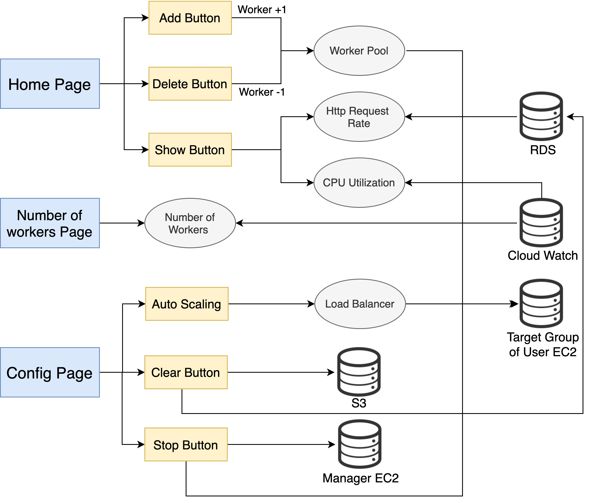
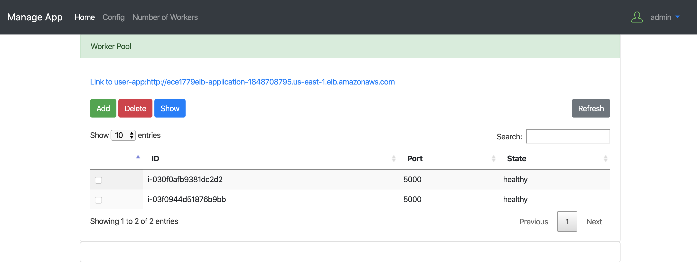
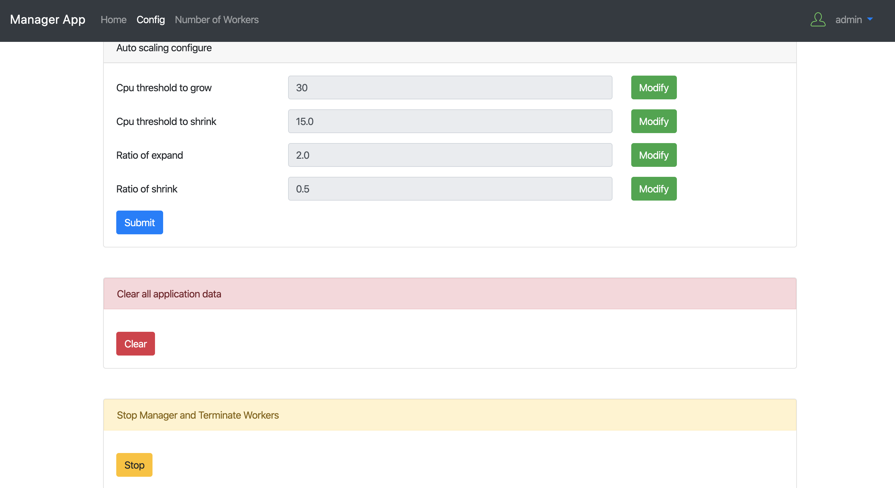
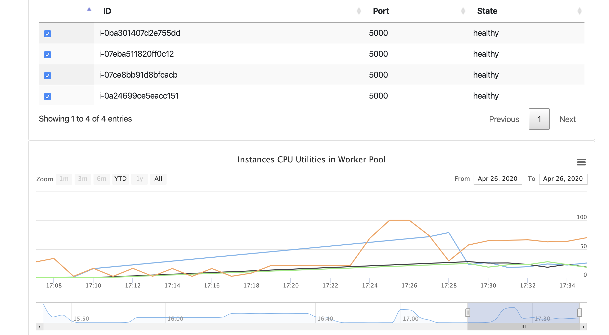
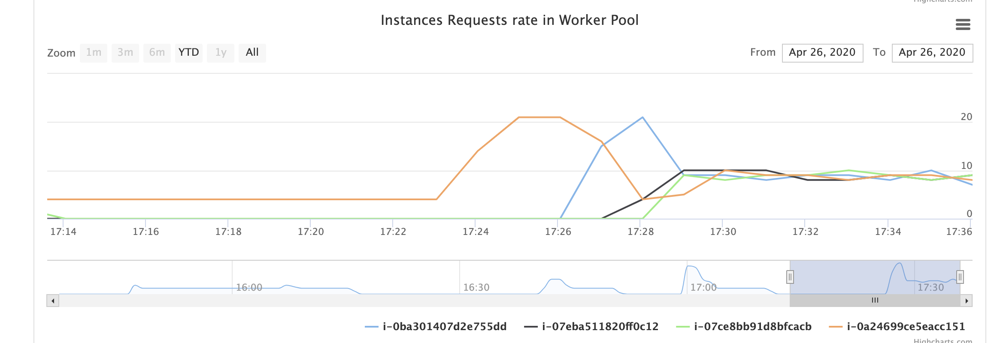

# Work Load Management Web Application

Group project from course "Cloud Computing". This cloud-based web application is hosted on AWS EC2 instance. It serves the purpose of load balancing and auto scaling for the object detection application using AWS Elastic Load Balancer and CloudWatch. The admin has the ability to configure the auto scaling parameters such as CPU utilization threshold for expanding and shrinking work pool. 

<table>
 <tr>
    <td></td>
 </tr>
 <tr>
    <td></td>
 </tr>
 <tr>
    <td></td>
 </tr>
 <tr>
    <td></td>
 </tr>
 <tr>
    <td></td>
 </tr>
</table>

